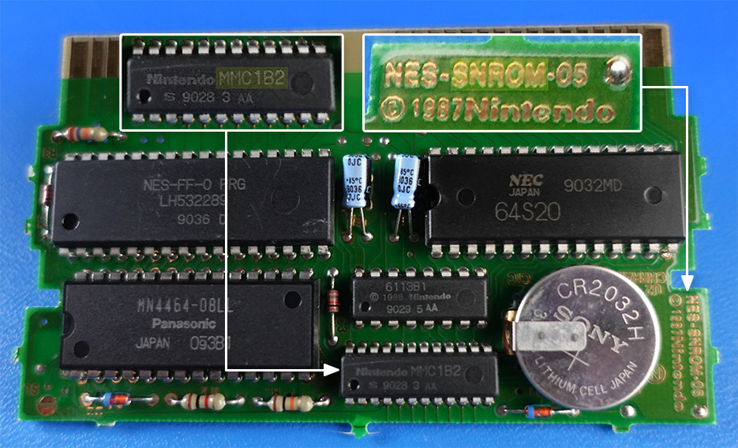

# Final Fantasy ROM Notes

## Overview
This is a "quality of life" hack to modify the game to make it easier to buy
multiple consumable items (e.g. HEAL, PURE, etc.) at once when shopping.

After quite a bit of exploration and experimentation I found a large empty
region in Bank `$06` to put most of the hack code. By isolating reactions to
events (e.g. choosing an item, buying an item, leaving a shop, etc.) and then
swapping to bank `$06` to execute major code changes, we reduce the chance of
breaking the core game by accidentally overwritting data in the main ROM.

### Board & ROM


- **Board:** [SxROM]() (`SNROM`, `NES-SNROM-05`)
- **Mapper:** [MMC1]() (`MMC1B2`)
- **CPU $8000-$BFFF:** 16 KB PRG ROM bank, **SWITCHABLE**
- **CPU $C000-$FFFF:** 16 KB PRG ROM bank, **FIXED TO LAST BANK** (`$0F`)

### ZeroPage Temporary Memory
The zero page addresses from $00 to $0C do not appear to be used when in the
shopping code. To implement the new functionality, I use them as temporary state
while shopping.

Address | Purpose
--------|-----------------------------------------------------------------------
$00     | Return Bank
$01     | Hack Routine Index
$02     | Hack Routine Address Lo-byte
$03     | Hack Routine Address Hi-byte
$04     | Item Quantity
$05     | Gold Total (Byte-0)
$06     | Gold Total (Byte-1)
$07     | Gold Total (Byte-2)
$08     | Item Price Memo (lo-byte), Quantity BCD (d0-d1)
$09     | Item Price Memo (hi-byte), Re-render Flag (bit 7)
$0A     | Gold BCD (D0-1)
$0B     | Gold BCD (D2-3)
$0C     | Gold BCD (D4-5)

## Code Injection / Hook Locations

### Bank $0E (Shop Logic)
Used? | BANK | CPU RAM | ROM     | Length (Used)  | Notes
------|------|---------|---------|----------------|----------------------
[ ]   | $0E  | $AD19   | $03AD29 | 22             |
[x]   | $0E  | $84E3   | $0384F3 | 28             | onQuantityChange
--    | $0E  | $84EB   | $0384FB | --             | onVblank
[x]   | $0E  | $8469   | $038479 | 22             | onShopExit
[x]   | $0E  | $82F5   | $038305 | 10             | callHack0E

### Bank $0F (Fixed Bank)
Used? | BANK | CPU RAM | ROM     | Length (Used)  | Notes
------|------|---------|---------|----------------|----------------------
[ ]   | $0F  | $FFCD   | $03FFDD | 17             |
[ ]   | $0F  | $FFB9   | $03FFC9 | 7              |
[ ]   | $0F  | $FFA4   | $03FFB4 | 4              |
[x]   | $0F  | $FF82   | $03FF91 | 13 (8)         | swapAndJumpToHack
[ ]   | $0F  | $FF3C   | $03FF4C | 4              |
[x]   | $0F  | $FDF2   | $03FE02 | 13 (13)        | callHack

### The Great Void (Bank $06)

* **Bank:** `$06`
* **Start Address:**  `$01ACB0` (CPU: `$ACA0`)
* **End Address:**    `$01C00F` (CPU: `$BFFF`)
* **Length (bytes):** `4960`    (~4.84KB!!!)

The "great void" is a region at the end of bank 6 that is a massive sea of 0s
that seems to be entirely unused. It is the only very large contiguous region to
be found in the Final Fantasy ROM, as far as I can tell.

> Initially I tried to inject the modifications into nooks and crannies found
> throughout the `$0E` and `$0F` banks. The routine for performing the total
> calculation forced my hand, though, since it was reasonably large (well over
> 40 bytes) and I didn't have a place I could easly put it while keeping the
> code continguous. Assuming there might be a better spot for all this, I found
> the void while doing a survey across all the ROM banks.

#### Assigned

##### Head

 CPU     | ROM     | Bytes | Label / Notes
---------|---------|-------|----------------------------------------------------
$ACA0    | $01ACB0 | 96    | hackMethodAddressTable
$AD00    | $01AD10 | 32    | executeHack
$AD20    | $01AD30 | 16    | cleanupZeroPage
$AD30    | $01AD40 | 32    | initializePriceQuantity
$AD50    | $01AD60 | ??    | changeQuantity
$AD90    | $01ADA0 | ??    | renderQuantityAndTotal
$????    | $?????? | ??    | buyItems

##### Tail

 CPU     | ROM     | Bytes | Label / Notes
---------|---------|-------|----------------------------------------------------
$BF00    | $01BF10 | ??    | renderNametable
$BF90    | $01BFA0 | ??    | calculateTotal
$BF50    | $01BF60 | ??    | quantityToBCD
$BF20    | $01BF30 | ??    | updateShopState

## Notes

### Inventory Item Counts
Found this out pretty early, the value for each of the items in the inventory is
stored in the PRG-RAM as a table starting at `$6020 + X` where `$16 <= X < $1C`.
I think that more item quantities are stored beyond there, but this is the range
for consumables (which are what we care about for this hack).

### Store Item Memory
$45	Store Index
>	This appears to determine the type of store and what it sells when entering
>	a shop from any town map. These appear to be valid item shop values:
>	3d, 3f, 40, 41, 42

Looks like $45 gets copied to $51 for some reason

$83A6	What's here? We just copied 4 bytes at this offset to $300 - $303

So what appears to happen, is the store index is used to grab item id offsets
from a lookup table somewhere around $83A6. These values are then copied into
the $300 - $304 memory locations. You can change these to change what a store
sells.

So it looks like the code for item stores differs from that of weapon stores and
armor shops. You can hack the memory to add a weapon into any of the 5 item
slots for the store, but if you buy a weapon from the item shop it will show up
in the items menu. Further, if you try to use, say... the Masamune from the
items menu the game appears to crash.

It does seem to be possible to buy 4 Masamune and equip them no problem however,
but you must do so from a weapon shop.

### Store Menu Logic
When 'a' is pressed on a menu the program does come fairly convoluted logic
checking bouncing a "modified" value for the controller mask into A via TXA and
checking the high bit to determine which button was pressed (going through
checks for #$10, #$20, #$40, and finally #$80).

When it detects that the "a" button has been pressed, it increments $24, then
grabs the value of $21, EORs it with #$80 and stores it back into $21 (why it
does this is quite beyond me). At this point it returns from two nested
subroutines and then jumps into APU code which I believe probably queues up the
sound for the button press on the menu.

At this point it breaks back out into the cursor movement code where it checks
to see if $24 has been incremented. It then, hilariously, clears the carry bit,
BCCs to a bit of code that zeros out $24, $25, and $22, then RTS the hell out.

So the CLC wasn't an accident, it needs to be cleared later at $A484 otherwise
there is a side effect (it nopes out of further logic and just exits the
subroutine). Also, the CLC followed by the BCC is actually 2 cycles faster since
we need to clear the carry bit anyway (at first glance it looks funny, but it
now makes a lot of sense).

The program then checks the cursor index ($62) and if it's not zero, it RTS.
Otherwise it jumps into two subsequent subroutines: $AA5B and then $A8C2. The
first routine leads to a very convoluted series of jumps and deeper routines
eventually leading to a bank swap. It's a bit too hard to keep track of things
from here.

I tried setting a breakpoint to see when $21 is read next, but it doesn't seem
to be read at all prior to the transition. It's eventually written over with
#$09 and the trail goes cold :(

### On Item Selection

When you press 'a' to select an item to buy the routine does the following

1. Load the cursor index ($62) into A
2. Left shift the value 3 times
3. Add #$15 (#21) and store it into $3E

This would be the same as multiplying the index by 8 and adding 21.
`$3E <- (($62 << 3) + 21) == $3E <- cursorIndex * 8 + 21`

Seems to indicate that there is a region in RAM that's offset by 21 bytes where
information about the items loaded for the store are held. Each item has 8 bytes
of information (thus 8 times the cursor index + 21 byte offset).

Next, we clear the carry flag, add 2 to the result and transfer it to the X
register. So at this point `X = (cursorIndex * x + 21) + 2`. So the next bit of
code seems to make this clear:

```
0E:AA78: A9 00     LDA #$00     ; Zero-out $0300 + X
0E:AA7A: 9D 00 03  STA $0300,X
0E:AA7D: CA        DEX
0E:AA7E: BD 00 03  LDA $0300,X  ; Store value at $0300 + X to $030C
0E:AA81: 8D 0C 03  STA $030C
```

`$030C` is the shop item index for the selected item, so this is how it's being
copied into place upon selection.

Yeah, this is all starting to make alot more sense. I'm pretty sure that $03XX
is used as general purpose state for various parts of the game. In this case it
holds state related to the shop, and what items are being sold. I think with a
bit more prying I should be able to determine the exact byte layout for each of
the items being sold. At that point we have all the info we need to make the
gold value injection routine.

Also $3E-$3F is holding the lo-byte and hi-byte of an address: $0315 (for cursor
index 0) upon item selection. My guess is that $0315 is the start of where data
for the items are being stored.

The bytes in memory at this point starting at $0315 and assuming a 8-byte record
struct can be arranged as follows for the 3 items in the first item shop:

```
03 19 00 02 1A 01 FF FF
03 1A 01 02 16 01 FF FF
03 16 01 00 00 00 00 FF
```

Not sure how to interpret this, exactly, but the item ids are definite at the
index + 1 as 19 is HEAL, 1A is PURE, and 16 is TENT according to my item id
notes. I was hoping to see the prices here as well or something, but doesn't
look like they have been loaded into this part of the ram.

#### Subroutine: $ECB9
AHA! I figured out what this routine is doing. It's a function that, given an
item index in the accumulator, will write the PRICE for the item into $10-$11!
Apparently the price information for these items is on bank 13. HA!

##### $ECB9 Routine Overview
1. Set `$12-$13` to an indirect address based on the item index (item price)
2. Bank switch to `$0D` (this is where the item price information is)
3. Copy the values at $BC32-$BC33 to $10-$11 (`$3C` and `$00`, or 60 gold)
4. Zero-fill $12 (new address is maybe $BC00?, possibly just cleanup?)
5. Bank switch to `$0E` and return

##### Detailed Notes

The program then jumps into a subroutine located at `$ECB9`, here's what it
does:

0. On entry `A` holds the item index (in this case `$19` for HEAL)
1. `$12 <- A << 1` (`$12` now equals `#$32`)
2. `$13 <- $BC` (if carry clear), `$13 <- $BD` (if carry set)

This forms an indirect addres at `$12-$13`, which for the HEAL item index
gives us an absolute address of `$BC32`.

We then then set `A = #$0D` and jump into a subroutine at `$FE03`, which then
immediately jumps to `$FE1A`. This swaps the PRG-ROM bank to whatever is
currently in the accumlator (in this case `$0D` or bank 13).

I ran throught he swap to see what bank is fixed, and after it executed it was
clear that *the lower 16KB PRG-ROM bank is the swappable one*! This was
something didn't know yet, so it's rad we figured that out while doing something
else.

> In retrospect I realize now that I could have known this relatively early
> simply by looking to see if the upper bank was 0F or the lower bank was 00. If
> either of them ever deviated from those numbers it would tell me how the board
> was handling the fixed vs switchable banking.

The program then proceeds to write the contents of $BC32-$BC33 to $10-$11
resulting in `$10 = #$3C` and `$11 = #$00`.

Next it zero-fills the value at `$12` which might mean we're grabbing something
at `$BC00` or it could mean that `$12` is now being used as some other form of
state...

It then loads `A = $0E` and initiates a bank switch by jumping to `$FE03`. This
pops us out of the routine and back to where we originally entered, but now with
the lower prg-rom bank set to `$0E` (bank 14).


### Tracing the Exit Code

- Bank `$0E` seems to be loaded when you're in a store
- Looks like `$62` being set to 1 determines if we "leave" the shop on A press
- `$62` gets set as a result of moving the cursor, but only on the first menu...
- Also, exiting the shop by pressing B works slightly different, as $62 is not
  set but the carry flag IS set (this explains the BCS @ A484).

# Item Shop Menu State
Okay, so after doing some experimentation I think I found a variable that is
correlated to which menu you are on when in an item shop: `$54`:

> Turns out that I was *partially* correct about how `$54` is being used here.
> In Bank `$0F` there are a bunch of routines that perform drawing for 8-tile
> wide menus. I found one such routine at `0F:E0A8` (`03E0B8`) that performs
> clearing for the menus. The routine uses `$54-$55` as a lo-byte/hi-byte pair
> to determine at which VRAM address it will create a clear menu line in the
> nametable.

Value | Shop State          | Menu Options
------|---------------------|---------------------------------------------------
CB    | Shop Action Menu    | Buy / Exit
26    | Item Selection Menu | Items based on values in $0300 - $0304
C9    | Confirm Buy Menu    | Yes / No

In order to detemine if we should increment or decrement the quantity the logic
goes as follows: `$54 == #$C9 && ($20 == #1 || $20 == #2)`. This will only be
`true` if the player is in the "Confirm Buy Menu" AND <- OR -> has been pressed.

As far as a hook is concerned for handling the execution of the inc/dec for the
quantity, it seems that `$0E:A761` is a pretty good spot to start looking as it
is executed directly after we've executed the common input handling code in the
`$0F` bank and prior to handling any other logic for the shop.


# Shop Menu Rendering

> I ended up scrapping trying to use the game's actual rendering mechanisms
> keeping these notes just because I might want to go back down that path again
> at a later date...

This code gets executed prior to rendering the price of an item in the menu
renderer (specifically when a PURE is selected):

```
 0E:AA41: AA        TAX
 0E:AA42: BD 40 AC  LDA $AC40,X @ $AC43 = #$06
 0E:AA45: 85 38     STA $38 = #$06
 0E:AA47: BD 45 AC  LDA $AC45,X @ $AC48 = #$12
 0E:AA4A: 85 39     STA $39 = #$12
 0E:AA4C: BD 4A AC  LDA $AC4A,X @ $AC4D = #$09
 0E:AA4F: 85 3C     STA $3C = #$09
 0E:AA51: BD 4F AC  LDA $AC4F,X @ $AC52 = #$0A
 0E:AA54: 85 3D     STA $3D = #$0A
>0E:AA56: A9 0E     LDA #$0E
 0E:AA58: 85 57     STA $57 = #$0E
 0E:AA5A: 60        RTS
```
A appears to be a parameter which is an offset that looks up data in a table at
the following offsets in Bank $0E:

- $AC43 + X => $38
- $AC45 + X => $39
- $AC4A + X => $3C
- $AC4F + X => $3D

The routine also loads a constant #$0E (14) into $57. So I wonder what these are
controlling? Are they addresses and a counter of some sort?

After returning we jump into another routine that does the following:

```
>0F:E063: A5 38     LDA $38 = #$06
 0F:E065: 85 3A     STA $3A = #$02
 0F:E067: A5 39     LDA $39 = #$12
 0F:E069: 85 3B     STA $3B = #$06
 0F:E06B: 20 AB DC  JSR $DCAB
```

So now we have $3A, $3B, $3C, and $3D all loaded with values from a lookup
table. This these have to be some sort of control or address varables... And
there we have it:

```
>0F:DCAB: A6 3B     LDX $3B = #$12
 0F:DCAD: A5 3A     LDA $3A = #$06
 0F:DCAF: 29 1F     AND #$1F
 0F:DCB1: 1D F4 DC  ORA $DCF4,X @ $DCF7 = #$60
 0F:DCB4: 85 54     STA $54 = #$C7
 0F:DCB6: BD 14 DD  LDA $DD14,X @ $DD17 = #$20
 0F:DCB9: 85 55     STA $55 = #$20
 0F:DCBB: 60        RTS -----------------------------------------
```

- `$3B` is an offset, used to lookup in a table at $0F:DCF4 and $0F:DD14
- ($3A & #$1F) returns only the lower 5 bits in $3A
- ($DCF4 + $3B) | ($3A & #$1F) => $54
- It looks like this is combining the upper bits in a lookup table with the
  lower 5 bits of the input parameter to produce a VRAM offset and store the
  result into the VRAM parameter for the nametable rendering function
- Effectively: where on the screen are we rendering (but convoluted using
  lookup tables, haha)

Okay, so a nametable is exactly 32 tiles wide (256 / 8 = 32). You only need 5
bits to store a number from 0 to 31, so that's why we're AND-ing with #$1F here.
So the value stored in `$38` / `$3A` is basically a "column" offset for where we
want to render in the nametable. That value get's OR-ed with the "row" value
that is found in a lookup table with the parameterized offset `$39 / $3B`.

> This routine is a parameterized method for setting the VRAM address variables
> based on a "Column" (`$38`) and "Row" (`$39`).

Next, we have the following routine:

```
 0F:E06E: A5 3C     LDA $3C = #$09
 0F:E070: 38        SEC
 0F:E071: E9 02     SBC #$02
 0F:E073: 85 1A     STA $1A = #$07
 0F:E075: A5 3D     LDA $3D = #$0A
 0F:E077: 38        SEC
 0F:E078: E9 02     SBC #$02
 0F:E07A: 85 1B     STA $1B = #$08
>0F:E07C: 20 FC E0  JSR $E0FC
```

- $1A = $3C - 2
- $1B = $3D - 2

Then we move along to what appears to be the rendering routine:

```
>0F:E0FC: 20 2E E1  JSR $E12E ppuScrollClear
 0F:E0FF: AD 02 20  LDA PPU_STATUS = #$00
 0F:E102: A5 55     LDA $55 = #$22
 0F:E104: 8D 06 20  STA PPU_ADDRESS = #$C7
 0F:E107: A5 54     LDA $54 = #$46
 0F:E109: 8D 06 20  STA PPU_ADDRESS = #$C7
 0F:E10C: A6 1A     LDX $1A = #$07
 0F:E10E: A9 F7     LDA #$F7
 0F:E110: 8D 07 20  STA PPU_DATA = #$00
 0F:E113: A9 F8     LDA #$F8
 0F:E115: 8D 07 20  STA PPU_DATA = #$00
 0F:E118: CA        DEX
 0F:E119: D0 FA     BNE $E115
 0F:E11B: A9 F9     LDA #$F9
 0F:E11D: 8D 07 20  STA PPU_DATA = #$00
 0F:E120: A5 54     LDA $54 = #$46
 0F:E122: 18        CLC
 0F:E123: 69 20     ADC #$20
 0F:E125: 85 54     STA $54 = #$46
 0F:E127: A5 55     LDA $55 = #$22
 0F:E129: 69 00     ADC #$00
 0F:E12B: 85 55     STA $55 = #$22
 0F:E12D: 60        RTS -----------------------------------------
ppuScrollClear:
; This routine will clear PPU_SCROLL if $37 is non-zero
 0F:E12E: A5 37     LDA $37 = #$01
 0F:E130: F0 13     BEQ $E145
 0F:E132: A5 FF     LDA $FF = #$08
 0F:E134: 8D 00 20  STA PPU_CTRL = #$08
 0F:E137: A9 00     LDA #$00
 0F:E139: 8D 05 20  STA PPU_SCROLL = #$00
 0F:E13C: 8D 05 20  STA PPU_SCROLL = #$00
 0F:E13F: 20 89 C6  JSR $C689
 0F:E142: 20 00 FE  JSR $FE00
 0F:E145: 60        RTS -----------------------------------------
```


```
>0F:C689: A9 0D     LDA #$0D
 0F:C68B: 20 03 FE  JSR $FE03 Bank Switch
 0F:C68E: 20 00 B0  JSR $B000               ; I Think this is sound code...
 0F:C691: A5 57     LDA $57 = #$0E
 0F:C693: 4C 03 FE  JMP $FE03 Bank Switch
```