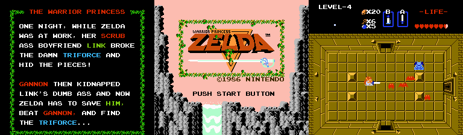

# Zelda: Warrior Princess
A Graphics ROM Hack for "The Legend of Zelda"

## Overview


This is ROM hack for the original Legend of Zelda that replaces the graphics so
that Zelda is on a quest to save link. In addition to replacing the link
animation sprites, I also updated the title graphics, and did some text and
attribute table hacking to rewrite the opening story.

## Patching

1. [Download LunarIPS](http://www.romhacking.net/utilities/240/)
2. Apply the [ZeldaWarriorPrincess.ips](./ZeldaWarriorPrincess.ips) patch using
   LunarIPS.

## Technical Notes

### Hack Details

1. Replaced the movement sprites
  - Used YY-CHR to find the sprite locations and data
  - Copied it over to photoshop to do the art
  - Copied it back and did palette replacements in YY-CHR
  - Once the bulk of the work was done I just used YY-CHR for touchups
2. Title screen text update (warrior princess)
  - Found this using YY-CHR
  - Had to fidget with the settings a bit to zone in on the location
  - Did all the graphics in YY-CHR
3. Closing text "Thanks Link" replacement
  - Wrote a zelda text encoding script
  - Found the text using the script, did a simple byte replacement
4. Opening Story Text Rewrite
  - Found all text using the script I wrote & replaced story
  - Cleaned up "quotation" marks from original story
5. Opening Story Attribute Table Changes
  - Ran the game until the PPU attribute table was updated, then looked
    the PPU memory to see its contents.
  - Found the ROM locations for the attribute table by simply copying the
    values from the PPU memory and searching for them in the ROM.
  - Tables were split with the upper half in one spot and the lower in another.
  - Upper Table ROM Address: `1A8B6`
  - Lower Table ROM Address: `1A8D9`
  - Did a live edit of the attribute PPU memory to get the colors right and
    then just copied the PPU ram and replaced the ROM values I had already
    found.

### Opening Story
```
------------------------
ONE NIGHT, WHILE ZELDA
WAS AT WORK, HER SCRUB
ASS BOYFRIEND LINK BROKE
THE DAMN TRIFORCE AND
HID THE PIECES...

GANNON THEN KIDNAPPED
LINK'S DUMB ASS AND NOW
ZELDA HAS TO SAVE HIM,
BEAT GANNON, AND FIND
THE TRIFORCE...
------------------------
```

#### Byte Replacements

| Address | Replacement Bytes                                  |
|---------|----------------------------------------------------|
| `1A52E` | `1D110E24200A1B1B12181B24191B12170C0E1C1C24`       |
| `1A595` | `18170E24171210111D2824201112150E24230E150D0A2424` |
| `1A5DB` | `200A1C240A1D2420181B142824110E1B241C0C1B1E0B2424` |
| `1A621` | `0A1C1C240B18220F1B120E170D2415121714240B1B18140E` |
| `1A667` | `1D110E240D0A1617241D1B120F181B0C0E240A170D242424` |
| `1A6AD` | `11120D241D110E2419120E0C0E1C29242424242424242424` |
| `1A6F3` | `242424242424242424242424242424242424242424242424` |
| `1A739` | `100A17171817241D110E172414120D170A19190E0D242424` |
| `1A77F` | `151217142A1C240D1E160B240A1C1C240A170D2417182024` |
| `1A7C5` | `230E150D0A24110A1C241D18241C0A1F0E24111216282424` |
| `1A80B` | `0B0E0A1D24100A1717181728240A170D240F12170D242424` |
| `1A851` | `1D110E241D1B120F181B0C0E636363242424242424242424` |

#### Attribute Table

**First Half (1A8B6):**
```
FFFF00000000FFFF
FF0B0A0A0A0A0EFF
FF000000C03A0AFF
FF000005050100FF
```

**Second Half (1A8D9):**
```
FFA02000000000FF
FF00000000C0F0FF
FF005A5A000000FF
FFFFFFFFFFFFFFFF
```


### Ending "THANKS" Text

- `Address: 00A969`
- `Old: 1D 11 0A 17 14 1C 24 15 12 17 14 28 22 18 1E 2A 1B`
- `New: 22 18 28 24 23 0E 15 0D 0A 28 24 24 22 18 1E 2A 1B`
